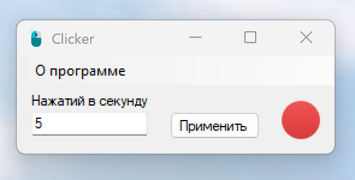

# Clicker.exe

## Описание
Программа `Clicker.exe` позволяет эмулировать нажатие левой кнопки мыши с заданным интервалом.

## Как использовать?
- Запустите приложение
- Укажите нужное количество кликов в секунду
- Нажмите один раз клавишу `Ctrl` чтобы начать эмулировать клики
- Повторно нажмите `Ctrl`, чтобы остановить
